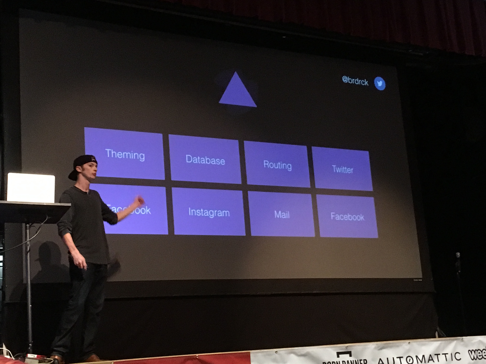
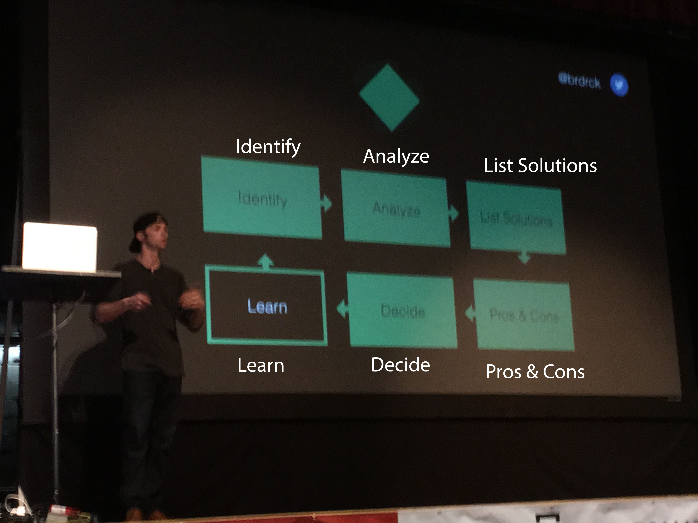
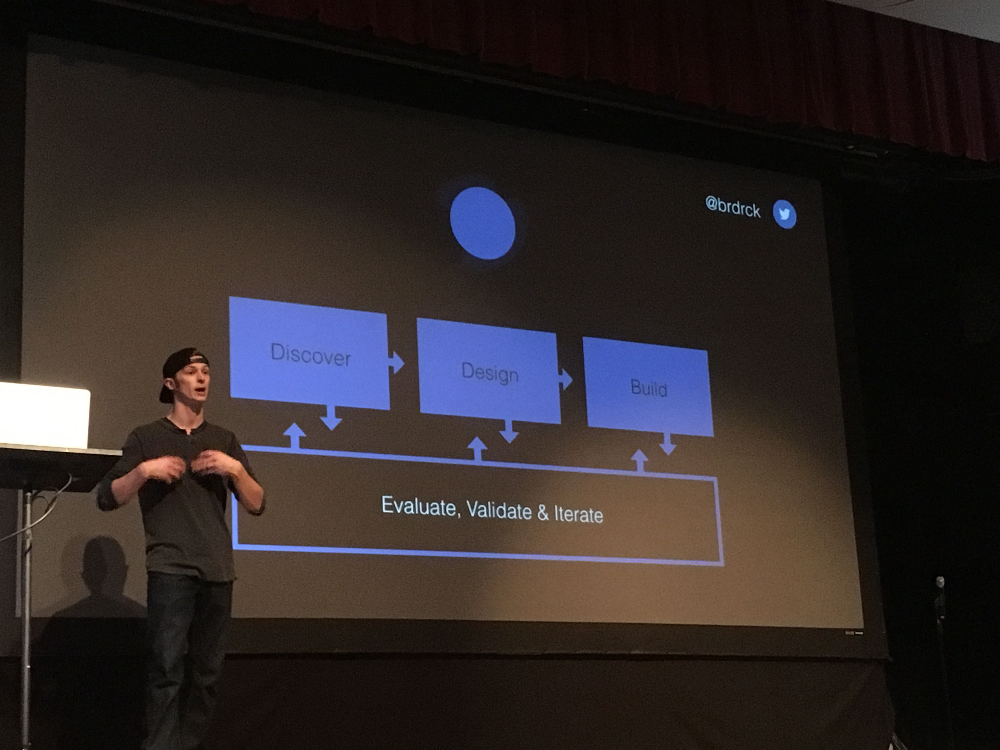

# Frameworks in Everything
Jeff Broderick

## What is a framework?
Broad overview, outline, or skeleton of interlinked items which supports a particular approach to a specific objective.

<figure>
    
    <figcaption>Jeff's personal framework</figcaption>
</figure>

They allow us to move faster, more consistently, in a scalable manner.

They are modular.

<figure>
    
    <figcaption>A general framwork (sorry about the quality)</figcaption>
</figure>

<figure>
    
    <figcaption>A product design framework</figcaption>
</figure>

### Discover Framework
* Personas
* Requirements
* KPIs - key performance indicators
* Comparative Research
* Flows/Models
* Information Mapping
* Scope & Timeline

### Visual Design
* Concept
* Visual
* Prototype

### Build
* Implementation Spec
* Quality Assurance
* Deploy

### Design Framework
* Motion & Interaction
* Style
* Layout
* Components
* Patterns

## Dive In
* Frameworks should start with your problem
* Don't worry about getting it right from the start
* They can be simple
* Make sure you know how the parts of your framework work together